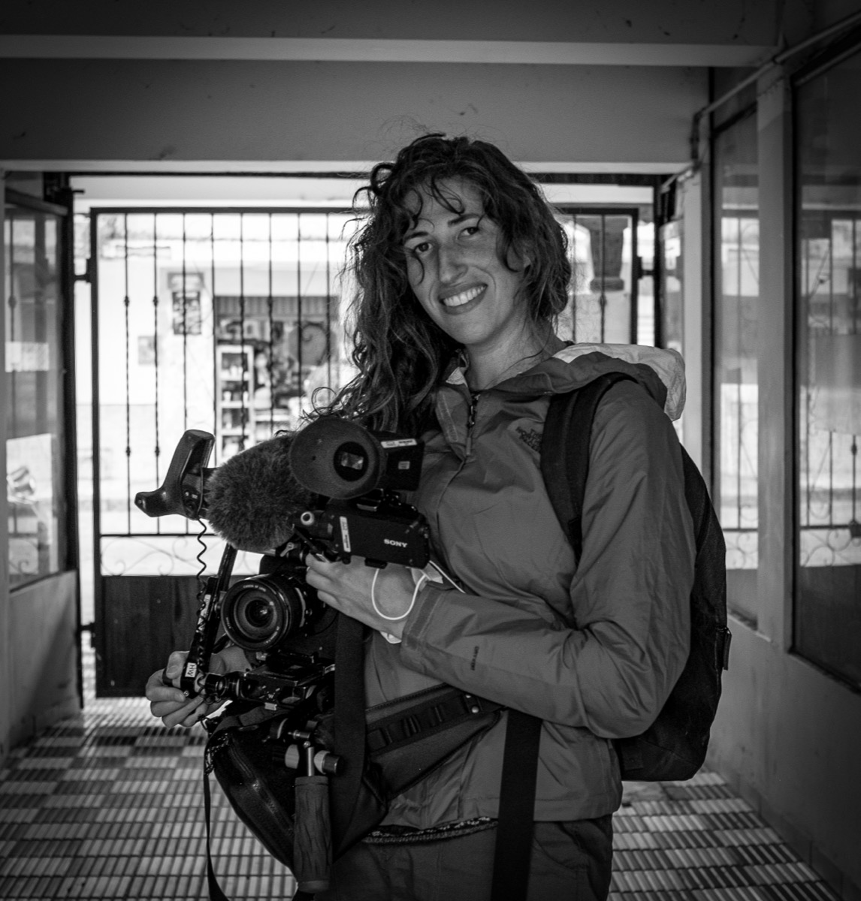

+++
title = "Program"
+++

## Overview

<table class="s">
  <colgroup><col class="tcol"/><col/><col/><col/><col/></colgroup>
  <thead>
    <tr>
      <th></th>
      <th>Mon 17 Aug</th>
      <th>Tue 18 Aug</th>
      <th>Wed 19 Aug</th>
      <th>Thu 20 Aug</th>
    </tr>
  </thead>
  <tbody>
    <tr>
      <td class="tc">Morning</td>
      <td class="c-arr">Arrival tea &amp; coffee</td>
      <td class="c-arr">Arrival tea &amp; coffee</td>
      <td class="c-arr">Arrival tea &amp; coffee</td>
      <td class="c-arr">Arrival tea &amp; coffee</td>
    </tr>
    <tr>
      <td class="tc"></td>
      <td class="c-wks">Workshops</td>
      <td class="c-cer">Welcome to CountryOpening ceremony</td>
      <td class="c-ple">Plenary 3Keynote / panel</td>
      <td class="c-ple">Plenary 5Keynote / panel</td>
    </tr>
    <tr>
      <td class="tc"></td>
      <td class="c-wks"></td>
      <td class="c-ple">Plenary 1Keynote / panel</td>
      <td class="c-ple"></td>
      <td class="c-ple"></td>
    </tr>
    <tr>
      <td class="tc">Mid-morning</td>
      <td class="c-tea">Morning tea</td>
      <td class="c-tea">Morning tea</td>
      <td class="c-tea">Morning tea</td>
      <td class="c-tea">Morning tea</td>
    </tr>
    <tr>
      <td class="tc"></td>
      <td class="c-wks">Workshops</td>
      <td class="c-ses">Session 1</td>
      <td class="c-ses">Session 4</td>
      <td class="c-ses">Session 7</td>
    </tr>
    <tr>
      <td class="tc">Lunch</td>
      <td class="c-lun">Lunch <a href="#film">'Sound Guardians' screening</a> </td>
      <td class="c-lun">Lunch <a href="#ecocom">EcoCommons Workshop</a> </td>
      <td class="c-lun">Lunch<a href="#wa">Wildlife Acoustics Workshop</a></td>
      <td class="c-lun">Lunch<a href="#fl">Frontier Labs Workshop</a></td>
    </tr>
    <tr>
      <td class="tc">Afternoon</td>
      <td class="c-wks">Workshops</td>
      <td class="c-ple">Plenary 2Keynote / panel</td>
      <td class="c-ple">Plenary 4Keynote / panel</td>
      <td class="c-ple">Plenary 6Keynote / panel</td>
    </tr>
    <tr>
      <td class="tc"></td>
      <td class="c-wks"></td>
      <td class="c-ses">Session 2</td>
      <td class="c-ses">Session 5Poster session</td>
      <td class="c-ses">Session 8ISE AGM</td>
    </tr>
    <tr>
      <td class="tc">Mid-afternoon</td>
      <td class="c-tea">Afternoon tea</td>
      <td class="c-tea">Afternoon tea</td>
      <td class="c-tea">Afternoon tea</td>
      <td class="c-tea">Afternoon tea</td>
    </tr>
    <tr>
      <td class="tc"></td>
      <td class="c-wks"></td>
      <td class="c-ses">Session 3</td>
      <td class="c-ses">Session 6</td>
      <td class="c-ses">Session 9</td>
    </tr>
    <tr>
      <td class="tc">Evening</td>
      <td class="c-ngt">Welcome reception*</td>
      <td>Australasian Chapter of Ecoacoustics AGM Location TBD</td>
      <td class="c-ngt">Dinner**</td>
      <td></td>
    </tr>
  </tbody>
</table>

\* Welcome reception is **included** in the registration fee. All delegates welcome. \** Dinner is paid separately

## Keynote Speakers

### Dr Xavier Raick







Xavier Raick is a Belgian marine ecoacoustics researcher. He held a
postdoctoral position at Cornell University and is currently a postdoctoral
researcher at Aarhus University. His work investigates how sound structures
marine ecosystems, particularly reefs. He studies underwater soundscapes across
scales, from large-scale ecological patterns to individual-level processes,
using passive acoustic monitoring to inform conservation strategies.

#### From soundscapes to individuals: zooming into marine ecosystems through sound

Monitoring the marine realm relies on a range of approaches, from classical
scuba diving surveys and citizen science initiatives to remote sensing
approaches, including satellite observations, environmental DNA, and passive
acoustic monitoring. In this context, soundscapes provide a powerful integrative
framework. They are useful for monitoring key ecosystems such as coral reefs,
and also reflect how animals themselves perceive and interact with their
environment. Soundscapes are implicated in the recruitment of reef taxa and have
fueled long-standing debates about the role of acoustic cues in multisensory
orientation and the spatial scales of larval settlement to reefs. However,
unlocking the ecological information they contain requires appropriate
methodological approaches. Methods developed for terrestrial soundscapes are
often not directly transferable and require explicitly considering the different
components of marine acoustic environments. Biological sounds, from
invertebrates to fish and marine mammals, vary along environmental gradients.
They can therefore serve as indicators of ecosystem state and the effectiveness
of conservation measures. At the community level, species share acoustic space,
making soundscapes a collective ecological resource. At the species level,
acoustic information can reveal presence and distribution patterns, at the
interface between ecoacoustics and bioacoustics. Beyond this, recordings also
open a window into interactions at the level of individuals, providing
behavioral insights and enabling fine-scale ecological monitoring. Taken
together, these perspectives show how marine soundscapes link ecosystems and
individuals across biological scales.

-------------------

### Dr Dominique Potvin






Dr Dominique Potvin is an Associate Professor in Animal Ecology at the
University of the Sunshine Coast, Australia. A behavioural and evolutionary
ecologist, she studies how animal communication systems evolve under ecological
and anthropogenic pressures, using bioacoustics, phylogenetics, and field
experiments. She is a Subject Editor for the Journal of Avian Biology and a
Fellow of Advance HE.

#### From noise to neighbourhoods: the ecological, cultural, and evolutionary forces shaping soundscapes

Soundscapes are increasingly used to assess biodiversity and ecosystem
change, yet they are often treated as passive reflections of the environment
rather than as biological phenomena shaped by behaviour, learning, and
evolution. Drawing on bioacoustic and behavioural research across various
vertebrate taxa and ecosystems, I explore how animals respond to changing
soundscapes, how local acoustic cultures emerge, and how these processes scale
up to communities. I argue that ecoacoustics will be most powerful when
soundscapes are understood not only as indicators of presence, but as outcomes
of ecological filtering and cultural evolution in a rapidly changing world.

-------------------

### Dr. Wendy Erb







With a background in biological anthropology and animal behavior, Dr. Wendy Erb
has studied the ecology, social behavior, health, communication, and
conservation of wild primates in Indonesia for the last two decades. Wendy’s
active participatory research program draws on diverse theories and methods from
the social and natural sciences – with a central focus on the sounds of nature –
to understand the shared worlds of primates and people. Having lived and worked
with Indigenous communities in Indonesia since 2005, Wendy is deeply committed
to cultivating deep relationships and co-creating meaningful research that
matters to local people, while constructively transforming the processes and
outcomes of sound-based science.

#### Tuning in together: Collaborative sound science reveals resonance across people, nature, and place

Wendy M. Erb 1,2 
<small>1 Cornell K. Lisa Yang Center for Conservation Bioacoustics, Cornell University, USA</small>  
<small>2 Cornell Lab of Ornithology, Cornell University, USA</small>

Soundscapes are a potent yet under-utilized avenue for understanding and
monitoring human-environment relationships. Sounds collected using autonomous
recording units (ARUs) are not only useful for understanding wildlife ecology;
they also document soundscapes that hold cultural meaning, represent
environmental knowledge, and shape community identities and practices. While
ARUs can provide snapshots of sound events, the embodied sensory knowledge of
people can enrich and challenge understandings of soundscapes and landscapes. My
work with customary knowledge-holders in front-line communities examines the
impacts of land-use change, wildfires, and urban development on Indonesia’s
forests and human and non-human residents. Weaving together data from ARUs,
soundwalks, listening sessions, and interviews, my partners and I document how
human-environment connection is captured, produced, and understood through
sound. This work explores the conservation potential of adopting an inclusive,
bioculturally grounded, sound-based research praxis that braids multiple ways of
knowing and demonstrates how transdisciplinary action research can lead to
improved understandings of and outcomes for the connections among people,
nature, and place.

## Monday Workshops

Workshops will be held on the Monday. Registered congress attendees will receive
a link to choose the workshop they would like to attend. We will prioritise one
workshop per person until capacity is reached to give everyone the opportunity
to participate.

See the headings below for more information on the workshops being offered.

### The Hitchhiker’s Guide to Acoustic Localisation



This workshop’s main target audience is ecologists and everybody who is
interested in broadening their understanding of bioacoustic methodology. In this
hour-long session, after a short introduction into the field of bioacoustic
monitoring, participants will learn how to set up our bioacoustic recorders, use
array configuration, test the machines for their functionality, and how the
resulting data can be processed and mapped.

Localisation through bioacoustics is becoming increasingly popular among
ecological consultants and researchers, and it is a valuable, low-impact, and
low-cost tool for monitoring population density and occupancy of target species
in a region. Especially animals that show cryptic behavior and are difficult to
observe actively can be detected and monitored this way. This workshop supports
collaboration and knowledge exchange in conservation technology by demonstrating
an accessible, replicable, and standardised approach to acoustic localization.
Workshop participants will learn how to correctly collect, store, and process
bioacoustic data. Ultimately, the goal is to fosters partnerships between
ecologists, engineers, and technologists advancing wildlife monitoring.

Active participants will need to bring their own laptops, as software and
example data will be provided to work along with the workshop explanations.



**Duration:** Half-day (approx. 3 hours)

**Workshop lead:** Frontier Labs

**Maximum number of participants:** 300

### Developing best practice guidelines for ecoacoustics in Australia



Ecoacoustic studies are often used to support developments
impacting our native wildlife and spaces. There is concern that lack of
standardisation in practice may be resulting in insufficient surveys,
inconsistent data collection and misinterpretation of results.

To increase awareness and understanding of the technique, we are developing a
guideline to provide foundational knowledge and set minimum standards for best
practice across the discipline. This will facilitate the appropriate use of the
technique in a wider range of applications and promote consistency and
standardisation, enabling effective data sharing and supporting robust
scientific investigation. The guideline will include practice in audible and
ultrasonic applications and is intended for use by anyone involved with acoustic
monitoring in Australia.

The project is working to ensure these guidelines reflect best practices and
encourage adoption within the community and industry.

During this workshop, we will introduce the project, then hold an interactive
session that promotes discussion and gathers feedback that will contribute
towards the guideline development."



**Duration:** Half-day (approx. 3 hours)

**Workshop lead:** May-Le Ng & Kristen Thompson - Ecoacoustics Guidelines Australia Project

**Maximum number of participants:** TBD

### Building and Running Recognisers with Ecosounds



This workshop is for researchers and ecoacoustics practitioners
undertaking acoustic monitoring of the environment for their species of
interest. We will use the Ecosounds cloud platform to build call recognisers,
run them at scale, verify detections and make sense of the results.

Prior to the workshop, participants will upload their datasets to Ecosounds,
either as public projects or private projects accessible only to them.

During the workshop participants will:
* Learn some basic, high-level theory on convolutional neural network embeddings.
* Build a custom call recogniser using Perch embeddings.
* Learn how to run this recogniser at scale over large ecoacoustic datasets in the cloud.
* Use the Ecosounds verification tools to rapidly validate detections.
* Explore methods to aggregate detections and incorporate results into their research.

While we are using the Ecosounds platform for this workshop, the recognisers you
build will be able to be used independently (without Ecosounds) on your own
compute resources in the future.

As part of our commitment to Open Science we request that all recognisers are
made freely available and open source. Note: there is no obligation to make
audio open, and uploading to ecosounds does not relinquish ownership of that
data in any way.

This workshop will be run by the Open Ecoacoustics team with support from the
ARDC.



**Duration:** Full day (approx. 6 hours)

**Workshop lead:** Philip Eichinski - Open Ecoacoustics

**Maximum number of participants:** 25

### Dandhigu Yimbana: Listening on Country and the Ethics of Ecoacoustics



Ecoacoustics holds profound potential for communities whose relationships with
Country are inseparable from health and wellbeing — yet the discipline
remains disproportionately concentrated within well-resourced institutions and
scientific research. This workshop invites delegates to explore how ecoacoustics
can be practised and shared more equitably and ethically, drawing on the
framework from the ARC Discovery Indigenous project "Dandhigu Yimbana:
Listening on Country for Social and Emotional Wellbeing".

This workshop positions listening as a relational act and will bring together
First Nations scholars, researchers, practitioners, and community members to
examine the ethical foundations of field recording and acoustic monitoring.
Participants will engage with questions around permission and consultation for
ecoacoustic recording and how to embed Indigenous data sovereignty and knowledge
into ecoacoustic research. The workshop will involve practical ecoacoustic field
recording and listening on Country, and is suitable for emerging and experienced
scientists and researchers wanting to explore the ethical foundations of sound
recording and the interdisciplinary potential of listening as a method to inform
research decisions.

The session aligns with WEC 2026's commitment to diversity and inclusion and the
theme “Making ecoacoustics accessible”. All field recording equipment will be
provided, and the participation of Elders are resourced through ARC Discovery
funding.



**Duration:** Full day (approx. 6 hours)

**Workshop lead:** Dr Leah Barclay - University of the Sunshine Coast, Creative Ecologies Research Cluster

**Maximum number of participants:** 25

### Reservoir Project



This participatory workshop explores relationships between water, sound, and
ecological grief through embodied listening and collaborative sonic practice.
Rooted in my interdisciplinary background in sound art, somatics, and
permaculture design, the workshop invites participants to consider water not
only as environmental infrastructure but as a living system we inhabit. Drawing
from hydrofeminist perspectives in Thinking with Water and ecoacoustic practices
such as Water and Memory by Annea Lockwood, the session examines how sound and
embodied awareness can restore relational ways of knowing water in times of
ecological crisis.

Participants begin with guided somatic listening exercises that attune attention
to the body as a fluid system shaped by breath and internal rhythms. Through
small gestures with water, stones, and vessels, they explore how subtle
movements generate sound and how water can function as a sonic collaborator. The
workshop culminates in a participatory ritual adapted from grief practices
described by Francis Weller. Participants place a stone representing personal or
ecological grief into a shared vessel of water while others create soft
wave-like vocalizations. The sounds of stones, water, and voices are recorded
and played back as a temporary sonic sculpture, emphasizing collective listening
and relational ecology.



**Duration:** Half-day (approx. 3 hours)

**Workshop lead:** Jai - Arizona State University

**Maximum number of participants:** 22

### From Priorities to Practice: Building a Global Bioacoustics "Network of Networks"



This workshop builds upon a global bioacoustics horizon scan identifying
priorities across five themes: next-generation recorders, analytical methods,
data exchange, global participation, and scaled impact. Following a successful
regional workshop at ICTC Peru, this three-hour session aims to design a
collaborative, regional-node-based global infrastructure: a ""Network of
Networks"" to organize and execute future actions.

The session maximizes co-design. After an introduction covering the horizon scan
and lessons from Peru, participants will divide into groups to identify action
steps and technical barriers across three areas. Theme 1 (Data & Standards)
focuses on PAM metadata, annotation protocols, large datasets, and soundscape
databases. Theme 2 (AI & Rigor) addresses recognizer building and incorporating
machine detection uncertainty into reporting. Theme 3 (Equity) explores ways to
make ecoacoustics globally accessible.

Following a break, a 60-minute facilitated mapping exercise will guide the
group. We will collaboratively map connections between existing regional
networks, labs, and initiatives to execute action plans, effectively defining
the overarching network's foundational architecture.

Expected outcomes include an ""Action Roadmap"" addressing key themes and the
formal initiation of the Bioacoustics Network of Networks, complete with defined
participant nodes, scoped collaborative projects, and communication channels to
ensure sustained momentum.



**Duration:** Half-day (approx. 3 hours)

**Workshop lead:** John Quinn - Furman University

**Maximum number of participants:** 45

## Lunchtime Workshops

### Using the EcoCommons Platform to Run Species Distribution Models with Acoustic Occurrence Data {#ecocom}



EcoCommons Australia provides a comprehensive platform for ecological modelling,
featuring thousands of curated datasets and expert-developed workflows for
species distribution and community modelling.

This workshop will begin with a brief introduction to species distribution model
(SDM) theory, followed by a guided tour of the platform. Participants will learn
how to incorporate occurrence data derived from acoustic monitoring into SDMs,
with a focus on selecting appropriate occurrence and environmental data for
different research questions. This workshop is suitable for beginners to
intermediate users with a basic understanding of ecological data. We will cover:

* Basic concepts and applications of SDMs and occurrence data
  * Manual surveys, camera trapping, passive acoustic monitoring (PAM)
* How to access biodiversity records from open data portals via EcoCommons platform
* Converting acoustic data into occurrence records
* An introduction to the EcoCommons platform and its 50,000+ curated environmental datasets
* Selecting appropriate environmental layers for modelling
* Building and running SDMs using acoustic occurrence data and a selection of 19 available algorithms on the EcoCommons platform
* Exploring and interpreting model outputs for use in biodiversity and conservation research and management
* Overview of EcoCommons coding notebooks and Occupancy Model example

By the end of the workshop, participants will understand how to:

* Navigate the EcoCommons platform
* Select fit-for-purpose data for your research question
* Run robust and repeatable SDMs with occurrence data derived from acoustic monitoring
* Produce and interpret SDM outputs (e.g. model evaluation metrics, habitat suitability maps)
* Access EcoCommons coding notebooks



**Duration:** 1-1.5 hours

**Workshop leads:**


Dr Ryan Newis is an ecological data scientist and modeller with extensive experience in the environmental sciences, data integration and analysis, species distribution modelling, and reproducible research workflows. As lead investigator on state and national projects, he develops scalable ecological modelling tools that inform biodiversity management and conservation planning. At QCIF, he contributes to the advancement of digital research infrastructure such as the EcoCommons platform, reproducible coding notebooks, and delivering stakeholder-driven environmental solutions. With a PhD from Griffith University in landscape and insect ecology, he combines strong analytical expertise, technical leadership, and applied research to bridge science and policy outcomes.



Dr Renee Piccolo is an ecological researcher and spatial analyst with expertise in biodiversity monitoring, restoration ecology, ecological data management, and environmental decision support. Her work focuses on the analysis and integration of large-scale biodiversity datasets, including camera trap monitoring programs used to assess wildlife populations, support conservation reporting, and inform evidence-based management. As a Postdoctoral Research Fellow at the University of Queensland and the Wildlife Observatory of Australia (WildObs), she collaborates with researchers, government agencies, and industry partners to improve biodiversity data workflows and deliver applied conservation outcomes. She completed her PhD through Griffith University and CSIRO, where she developed a decision-support framework to assess habitat restoration feasibility under complex biophysical, social, and governance constraints, using mangrove ecosystems as a case study. With a background spanning environmental consultancy, wildlife handling, and practical land management, she combines interdisciplinary research, analytical expertise, and on-ground experience to bridge science, policy, and restoration action.


**Prerequisites:** Please try to login to EcoCommons with your institutional
account (if you have one) through Australian Access Federation (AAF). If you
can't find your institution via AAF, or don't have one, please request a free
EcoCommons Account prior to the workshop.

**Materials required:** Laptop that can access internet.

### 'Sound Guardians' film screening {#film}

  

    
  

  

    

      <b>Synopsis:</b> Jakarta is the world's fastest-sinking city. In response,
      Indonesia's government is building a new capital city in the hills of east
      Borneo. But these hills are some of the planet's most biodiverse ecosystems
      and home to the indigenous Balik people. Abidin, a Balik elder, teams up
      with bioacoustic scientists to document the impacts of the new city's
      construction on endangered species through sound. With his tribe's survival
      at stake, recording the sounds of the forest is a way for Balik people to
      preserve their knowledge and pass it on to future generations – before it's
      too late. Sound Guardians is a cinematic and sonic celebration of east
      Borneo, encouraging the viewer to reflect on their own evolving soundscapes
      in a time of climate upheaval. <a href="https://www.youtube.com/watch?v=Bwo5luquTcQ&feature=youtu.be" target="_blank">View Trailer</a>.
    

    

      <b>Director Bio:</b> Leah is a two-time Emmy Award-winning documentary filmmaker based
      in Colorado and has been making short documentaries for over a decade. Her work has
      appeared on FX/Hulu, The New York Times, VICE News, The Atlantic, and more.
      A native of France, she speaks four languages which have helped her tell stories
      all over the world. She is passionate about character-driven storytelling that
      amplifies overlooked voices and advances climate justice.
    

    

      
    

  

### Wildlife Acoustics workshop {#wa}

TBA

### How to PAM – Theory and Praxis of Deploying an Acoustic Recorder {#fl}

We aim to introduce participants to the theoretical foundations, practical
applications, and growing relevance of Passive Acoustic Monitoring (PAM) in
ecological research and consultancy.

The short theoretical part will be followed by a practical demonstration: using
Frontier Labs’ BAR-V2 units, we will show how to create and install a recording
schedule, how to successfully deploy the recorder, and how to retrieve the data
at the end of the deployment. Different features and applications of the device
will be highlighted. Attendees are invited to follow along on their own laptops,
using our free scheduler app; however, this is not a requirement to participate.

The goal of this session is to equip attendees with a deeper understanding of
PAM and its increasing value in the ecological field, as well as giving them a
first glimpse into the practical side of the methodology. Participants are
invited to share their questions and their own experiences regarding bioacoustic
research. A lively and open discourse is hoped for, exploring the possibilities,
challenges, and future directions of PAM together.

**Speaker**: Kieran Aland

**Organisation**: Frontier Labs  
